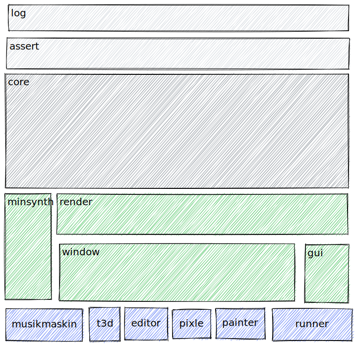

Euphoria is a data-driven "game engine". It's in quotes because

1. the term "engine" is really vague.
2. it also contains other things that aren't related to game engine at all (like csv import and a non-realtime ray tracer)

Euphoria is under heavy development, not ready for prime time, and the final product will be focused on live programming/automatic refresh between computer and target devices (that include computers) with a feature set that lies between love2d (do whatever you like) and fps game creator(restrictive but quick prototyping).

### Build status

### Code status

### [Test coverage](https://madeso.github.io/euphoria/coverage.html)

## Demos
* There is a [youtube playlist here](https://www.youtube.com/playlist?list=PLLZf3o2GDQ_iTb2AjfPWNMu0IPSetTOhx) that has small sample videos of some parts.

* Various [screenshots](data/screenshots.md) what the engine can generate.

* For each commit, theere are a few [html friendly things generated over here](https://i.madeso.me/euphoria/) such as doxygen, some color palettes and smaller tests for collision and debugging tools.

## About the code

The folder structure should follow the [pitchfork layout](https://github.com/vector-of-bool/pitchfork). `graveyard` contains old code that could be brought back to life but should more or less be considered deleted.

All names should follow `snake_case`, both for variables, members, functions and files. The only exception are C++ macros that should follow `SHOUTING_SNAKE_CASE` and structs & template arguments that should follow `PascalCase`.

## Naming guidelines
* Prefer to name function after what is returns, not the algorithm (`get_sorted` or `sort_inplace` vs `quicksort`).
* Prefer to name function after what is does, not how it does it (`add_item` vs `emplace_back_item`).
* Avoid general names(like `add` and `compile`), be specific (`add_object` and `compile_shader`) but don't be too specific.
* prefer [`from` functions and maps](https://lesleylai.info/en/from-vs-to/) instead of `to` functions: `let canonical_variable = canonical_var_from_num[num_from_var.get(var).unwrap()];`
* same applies to [matrix transforms](https://www.sebastiansylvan.com/post/matrix_naming_convention/) and points: `projection_from_object = projection_from_view * view_from_world * world_from_object;` and `world_point`
